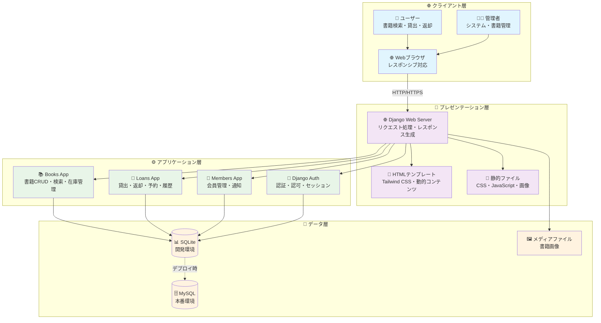
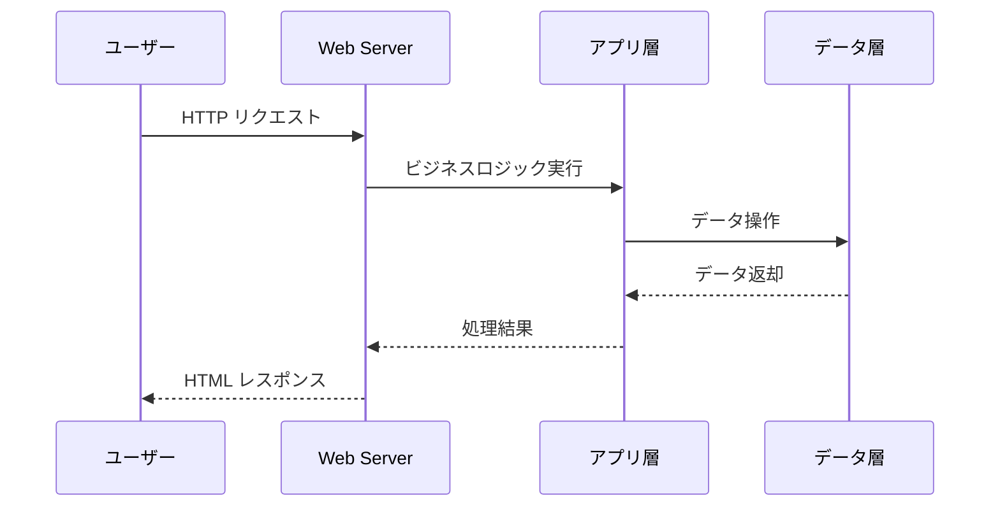
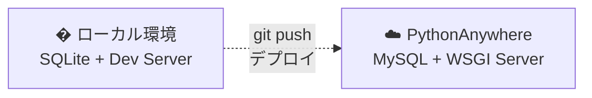
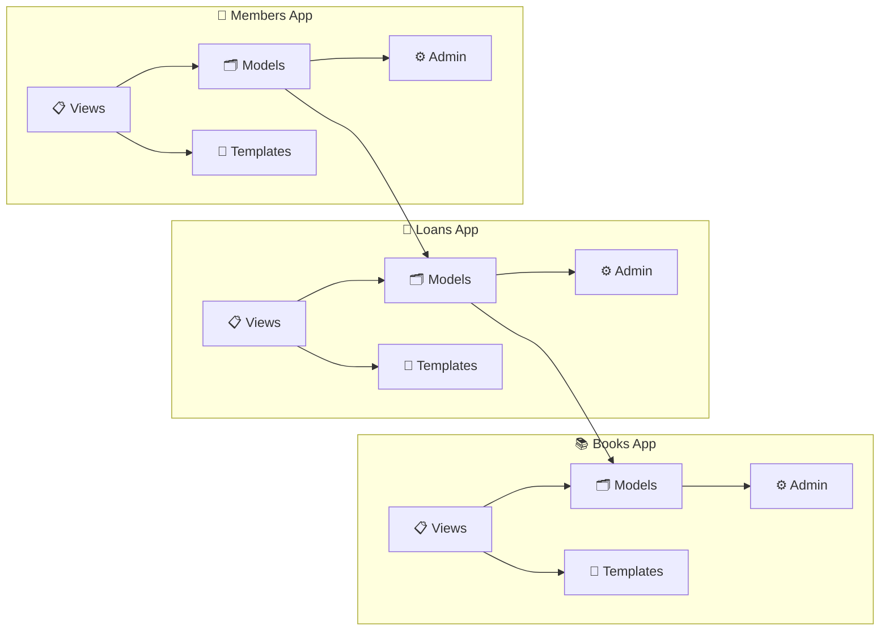
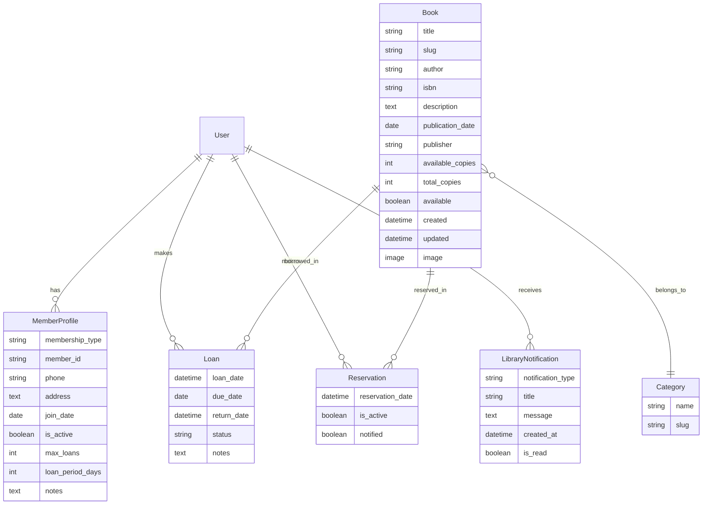
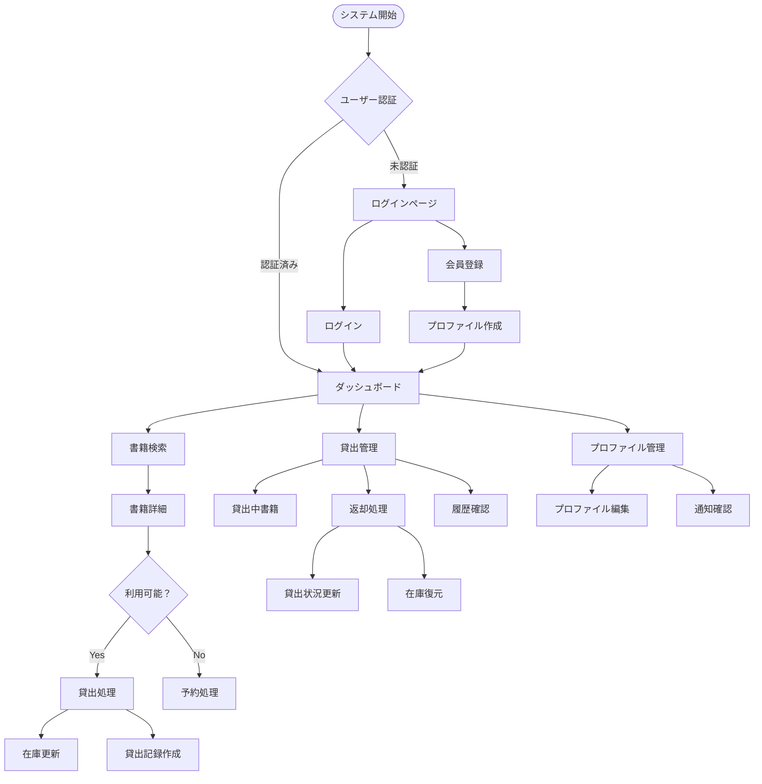
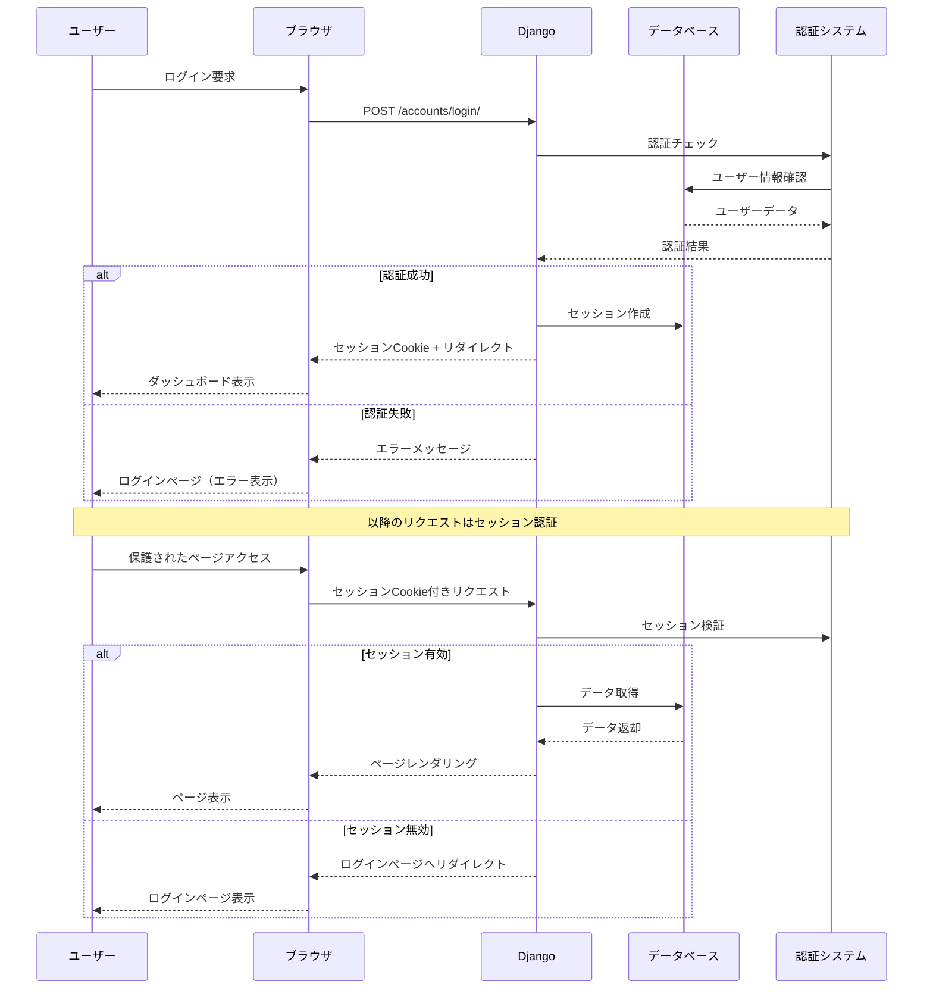
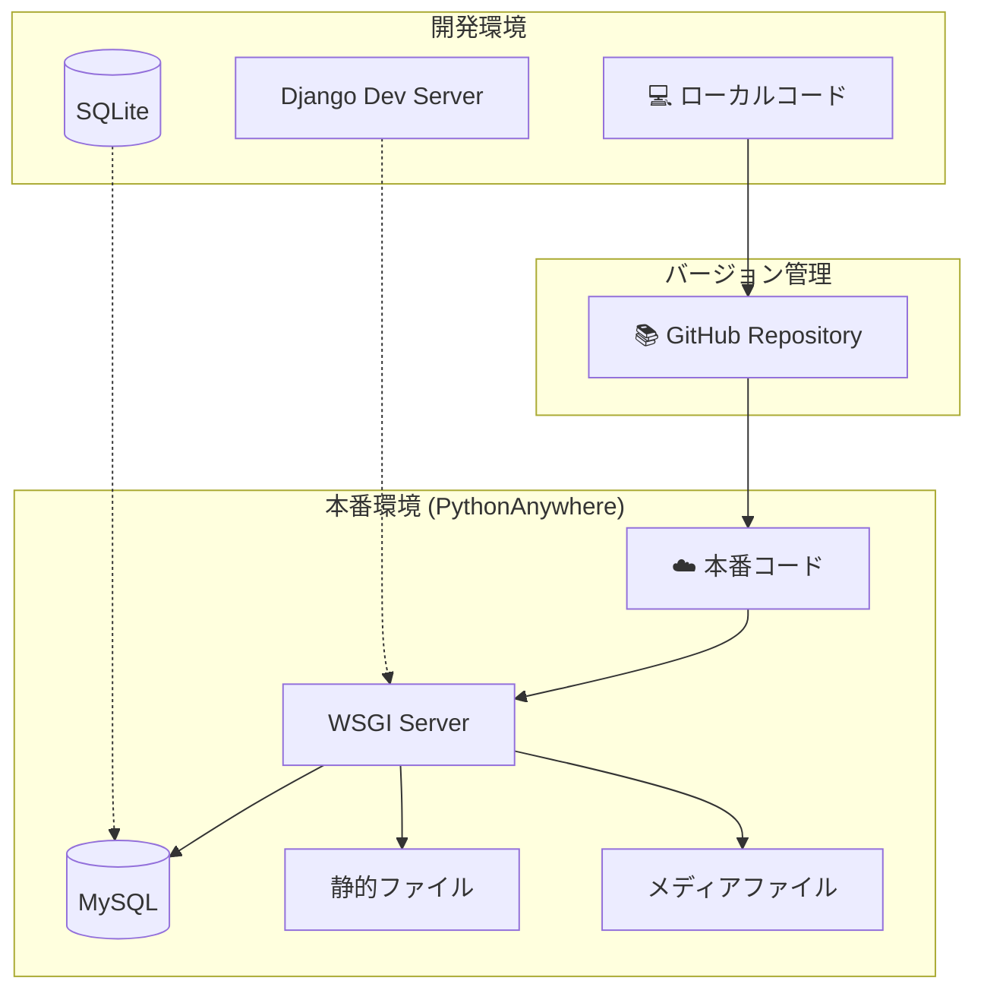
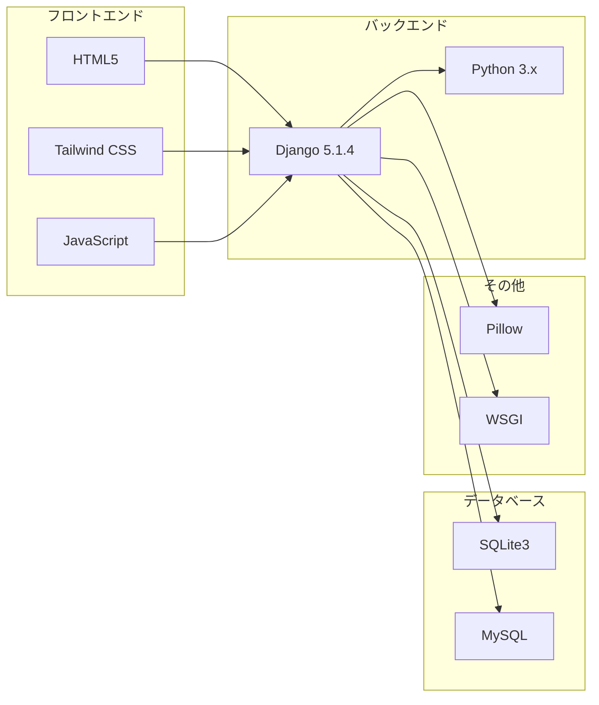
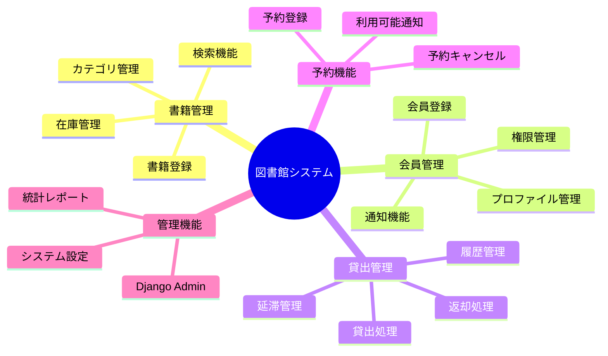

# 図書館管理システム - システム構成図

## システム全体アーキテクチャ

## システム全体アーキテクチャ

### 4層アーキテクチャ構成
図書館管理システムは、明確に分離された**4層アーキテクチャ**で構築されています。



### � 各層の概要

| 層 | 役割 | 主要技術 | 特徴 |
|---|---|---|---|
| **🌐 クライアント** | UI・操作入力 | HTML5, CSS3, JS | レスポンシブ対応 |
| **🎨 プレゼンテーション** | 画面制御・表示 | Django Templates, Tailwind | コンポーネント設計 |
| **⚙️ アプリケーション** | ビジネスロジック | Django Apps, Python | MVCパターン |
| **💾 データ** | データ永続化 | SQLite/MySQL, ORM | DB非依存設計 |

### 🔄 基本データフロー



### � デプロイメント環境



## Django アプリケーション構成



## データベース関係図 (ERD)



## URL ルーティング構成

```mermaid
graph TD
    Root[/ Root URL] --> BooksApp[📚 Books App]
    Root --> LoansApp[📖 Loans App /loans/]
    Root --> MembersApp[👥 Members App /members/]
    Root --> AdminApp[⚙️ Admin /admin/]
    Root --> AuthApp[🔐 Auth /accounts/]

    BooksApp --> BookList[📋 書籍一覧 /]
    BooksApp --> BookCategory[📂 カテゴリ別 /<slug>/]
    BooksApp --> BookDetail[📖 書籍詳細 /book/<id>/<slug>/]
    BooksApp --> BookSearch[🔍 検索 /search/]

    LoansApp --> LoanList[📋 貸出中 /]
    LoansApp --> BorrowBook[📚 貸出 /borrow/<id>/]
    LoansApp --> ReturnBook[🔄 返却 /return/<id>/]
    LoansApp --> ReserveBook[🔖 予約 /reserve/<id>/]
    LoansApp --> ReservationList[📋 予約一覧 /reservations/]
    LoansApp --> LoanHistory[📊 履歴 /history/]

    MembersApp --> MemberProfile[👤 プロファイル /profile/]
    MembersApp --> MemberRegister[✍️ 登録 /register/]
    MembersApp --> NotificationList[📬 通知 /notifications/]

    AuthApp --> Login[🔐 ログイン /login/]
    AuthApp --> Logout[👋 ログアウト /logout/]
```

## ビジネスロジックフロー



## セキュリティ & 認証フロー



## デプロイメント構成



## 技術スタック



## システムの主要機能


